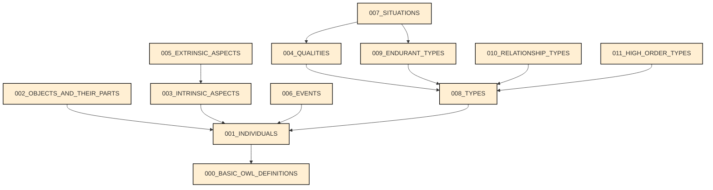

# UFO Standard Resources

This repository contains the resources used in the standardization of theUnified Foundational Ontology in conformance with the requirements of the ISO 21838-1:2020. The axiomatization presented here is based on the [gentle Unified Foundation Ontology (gUFO)](http://purl.org/nemo/doc/gufo), a lightweight representation of UFO designed to support semantic web applications in the Web Ontology Language (OWL 2). This UFO axiomatization organized into modules of the figure below, and represented in TPTP, Common Logic, and OWL 2. If you wish to develop semantic web applications using the terms and relations collected in this axiomatization, please consider using gUFO and the URIs defined there.

This repository is organized into the following files and scripts:

- [`.src//ufo-modularized-uris.ttl`](.src//ufo-modularized-uris.ttl): the modularized OWL 2 axiomatization of UFO based on gUFO ontology.
- [`./src/ufo-module-**.p`](./src/): the modularized first-order logic axiomatization of UFO in TPTP. Equivalence between the OWL 2 and the TPTP representations is guaranteed by the [Gavel OWL](https://github.com/gavel-tool/python-gavel-owl) tool employed in the translation process.
- [`./build/cliff/`](./build/cliff/): the modularized CL axiomatization of UFO compiled from TPTP using the [teep](https://github.com/nemo-ufes/tptp-editor-eclipse-plugin) Eclipse editor.
- [`./terms.xlsx`](./terms.xlsx): the natural language elucidation of all terms and relations present in the axiomatization.
- [`./build/theory-proof.txt`](./build/theory-proof.txt): the consistency proof proved by Vampire 4.8 and translated to the SZS Ontology by the [System On TPTP](https://www.tptp.org/cgi-bin/SystemOnTPTP) service.
- [`./scripts`](./scripts): folder containing scripts execution and quality of life improvements in the development of this axiomatization, including: the generation of theory files ([`./scripts/dependencies-manager.mjs`](./scripts/dependencies-manager.mjs)), generation modules graph and CSV tables of predicates ([`./scripts/csv-predicates-report.mjs`](./scripts/csv-predicates-report.mjs)), and communication to the System On TPTP service ([`./scripts/RemoteSoT.py`](./scripts/RemoteSoT.py)).

For questions and comments, please contact Claudenir M. Fonseca at [c.moraisfonseca@utwente.nl](mailto:c.moraisfonseca@utwente.nl).