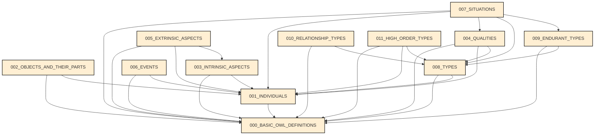
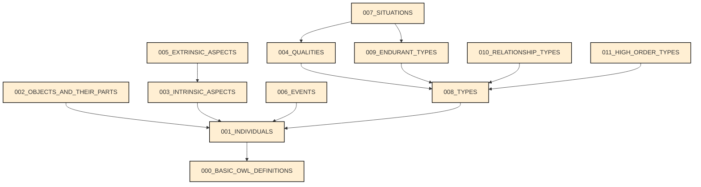

# Full Dependency Graph

This graph presents all dependencies between modules, i.e., an edge is added whenever the module uses a predicate that belongs to another one.

# Simplified Dependency Graph

This dependency graph consider dependency as a transitive relation and inferred dependencies are manually removed (27/06/2023).

